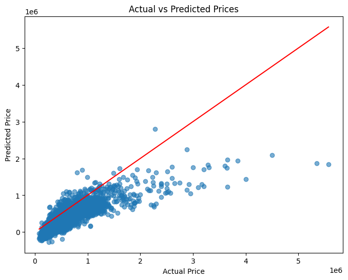

## Linear Regression Model From Scratch

This repository contains Linear Regression implemented from scratch using NumPy.

The goal of this project is to deeply understand the mathematical foundations and optimization techniques behind machine learning models without relying on high-level libraries such as scikit-learn.

## What This Project Demonstrates

- Implementation of Linear Regression using only NumPy
- Understanding of gradient descent optimization
- Feature scaling and preprocessing
- Custom train-test split implementation
- Model evaluation and visualization

## Implemented Models

- Linear Regression (Gradient Descent)

## Linear Regression Formulation

Linear Regression models the relationship between input features and the target variable using a linear equation.

\[
y = XW + b
\]

Where:

- \(X\) = Feature matrix
- \(W\) = Weight vector
- \(b\) = Bias
- \(y\) = Predicted output

### Loss Function

The model is trained by minimizing the **Mean Squared Error (MSE)**:

\[
MSE = \frac{1}{n} \sum_{i=1}^{n} (y_i - \hat{y}_i)^2
\]

This loss function penalizes larger prediction errors more heavily and helps the model learn the optimal weights.

### Gradient Descent Optimization

The model parameters are updated using gradient descent:

\[
W = W - \alpha \frac{1}{n} X^T (y_{pred} - y)
\]

\[
b = b - \alpha \frac{1}{n} \sum (y_{pred} - y)
\]

Where:

- \( \alpha \) = learning rate
- \( X^T \) = transpose of the feature matrix

## Visualization

The model predictions are evaluated by comparing **actual vs predicted values**.

A perfect model would lie along the diagonal line.



## Example Usage

```python
model = LinearRegression(lr=0.001, epochs=1000)

model.fit(X_train, y_train)

predictions = model.predict(X_test)

